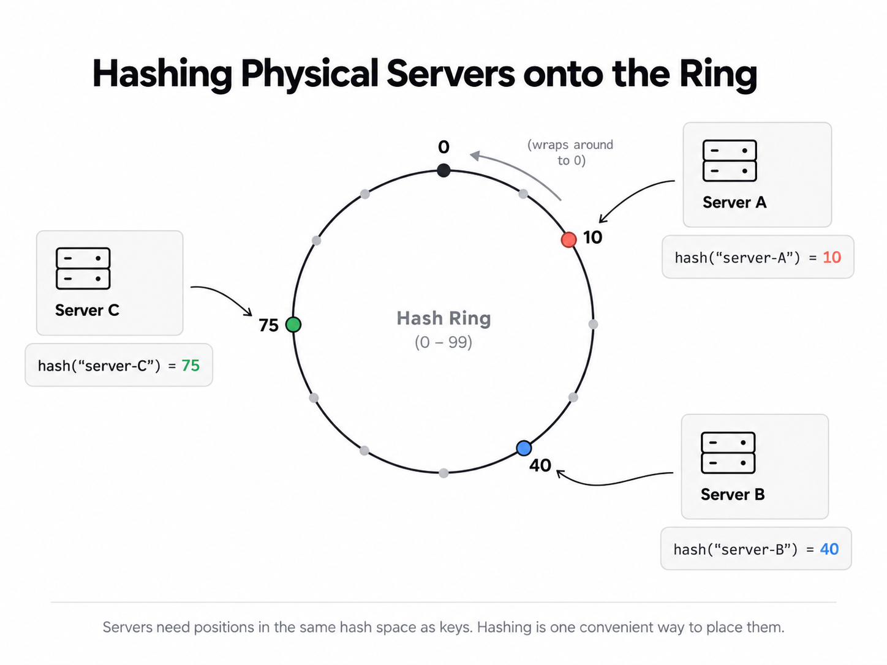
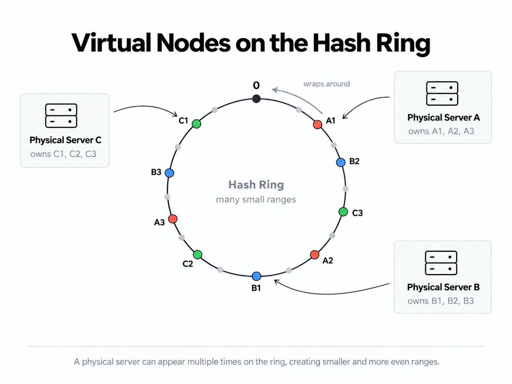
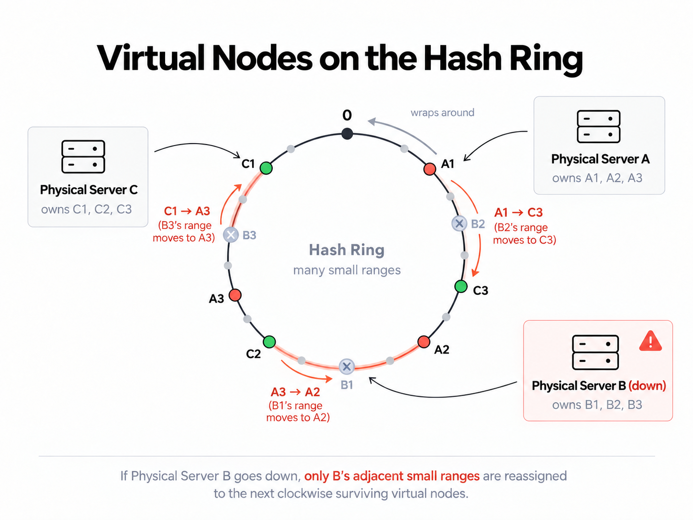

# Consistent Hashing

Say I have 4 caches that I use to divide the load. Just based on key I want to be able to map
it to some fixed server.

A simple way to find sever is just `hash(key) % num servers`. But in say a highly containerised
setup with autoscaling etc, or even just a simple case of some server dying or a new one being
added, any change in num server reshuffles keys entirely, across the whole range so this will
lead to a thundering herd due to all the cache misses all of a sudden.

## Something better is putting it all on a ring

Let's say my hash function for keys is SHA256 and I interpret the 256 bit range it produces as a
positive integer ( just convert binary to decimal ) for simplicity. Then what I can do is
just assign ranges of that hash to specific server. An equal distribution would be saying
each quartile of that ranges belongs to each of the 4 servers, I could have the severs have some
fixed "id" ( and this is always needed ) and map it one to one, smallest first.

A server with better hardware can take a larger chunk of the range as well if I partition based
on some weights. Any change in servers would cause some reallocations but never across the full
ring.

**hasing server ids** is another way and the one more common in such literature. Say I have some
id to the servers themselves, and I use the same hash to map those servers to the same space as
keys. Then you can say => move clockwise till you find the next server hash and the key belongs
to that server.

But the problem is either I manage the partition to make it even or accurate ( this is the best
but I would need to manage somewhat ) or we end up with an unequal distribution at the whims of
SHA256.

## Virtual nodes ( an algo to manage )

I said that you would have to have some alog to manage. This is one of those, the common one
in literature related to this.

Instead of a possibly inconsistent physical distribution, you define a large number of "virtual"
nodes. So for example `A -> A1, A2, A3`. Any keys belong to the virtual node Ai belongs to the
physical node A. If you have large enough number of nodes, the random output of hash ensures
an even distribution. You can even do weighing based on having a larger number of virtual nodes
assigned to better hardware servers and smaller number of nodes assigned for the weaker ones.

To visualise how much of the range is keys get re-distributed if a server goes down.

## But who "decides" how to route and who is up?

| Mode                                   | Who owns the hash ring / routing logic? | Request flow                                    | Who tracks health/membership?                                | Typical use                          |
| -------------------------------------- | --------------------------------------- | ----------------------------------------------- | ------------------------------------------------------------ | ------------------------------------ |
| **Proxy / Load Balancer**              | A dedicated proxy or routing layer      | `Client → Proxy → Correct server`               | Proxy / service discovery layer                              | Distributed caches, sharded services |
| **Distributed / Any-node coordinator** | Every server knows the ring             | `Client → A → C → A → Client` if C owns the key | Cluster nodes via gossip, heartbeats, failure detection      | Cassandra / Dynamo-style systems     |
| **Client-side routing**                | Client library knows the ring           | `Client → Correct server directly`              | Client library gets membership from config/service discovery | Memcached-style systems              |

Note that client sides to me means still internal infra or something that has visibility
on the intranet; obviously this cannot be an app or browser client.
